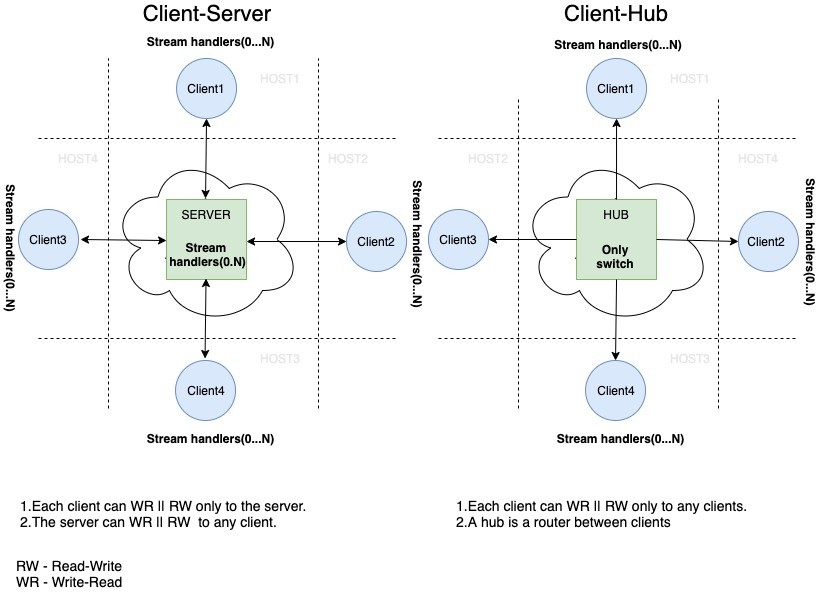

# go-wirenet
Simple  bidirectional TCP stream server. Useful for NAT traversal.
---
[](https://coveralls.io/github/mediabuyerbot/go-wirenet?branch=master)
[][godocs]

[godocs]: https://godoc.org/github.com/mediabuyerbot/go-wirenet 

## Design

##### Client-Server
```
// client <-> server
client1 join  to the server  ---------NAT------> server
client2 join to the server   ---------NAT------> server
client3 join to the server   ---------NAT------> server
client4 join to the server   ---------NAT------> server

// call from the server
call client1 from the server ---------NAT------> client1
call client 2 from the server --------NAT------> client2  
call client 3 from the server --------NAT------> client3  
call client 4 from the server --------NAT------> client4

// call from the client
call server from the client1 ---------NAT------> server
call server from the client2 ---------NAT------> server  
call server from the client3  --------NAT------> server  
call server from the client4  --------NAT------> server
```
##### Client-Hub
```
// clients <-> hub
client1 join to the hub  ---------NAT------> hub
client2 join to the hub  ---------NAT------> hub
client3 join to the hub  ---------NAT------> hub
client4 join to the hub  ---------NAT------> hub

// call from the client
call client2 from the client1 ---------NAT------> client2
call client1 from the client2 ---------NAT------> client1 
call client2 from the client3  --------NAT------> client2  
call client1 from the client4  --------NAT------> client1
```

## Table of contents
- [Installation](#installation)
- [Examples](#examples)
    + [Creating connection](#creating-connection)
    + [Stream handling](#stream-handling)
    + [Stream opening](#stream-opening)
    + [Writing to stream](#writing-to-stream)
    + [Reading from stream](#reading-from-stream)
    + [Using authentication](#using-authentication)
    + [Using SSL/TLS certs](#using-ssltls-certs)
    + [Hub mode](#hub-mode)
- [Options](#options)    
     
### Installation
```ssh
go get github.com/mediabuyerbot/go-wirenet
```
### Examples
#### Creating connection 
```go
import "github.com/mediabuyerbot/go-wirenet"

// make server side
wire, err := wirenet.Mount(":8989", nil)
if err != nil {
    handleError(err)
}
if err := wire.Connect(); err != nil {
    handleError(err)
}

// OR make client side 
wire, err := wirenet.Join(":8989", nil)
if err != nil {
    handleError(err)
}

// connection
if err := wire.Connect(); err != nil {
    handleError(err)
}
```

#### Stream handling 
```go
import "github.com/mediabuyerbot/go-wirenet"

// server side
wire, err := wirenet.Mount(":8989", nil)
if err != nil {
    handleError(err)
}
// or client side
wire, err := wirenet.Join(":8989", nil)
if err != nil {
    handleError(err)
}

backupStream := func(ctx context.Context, stream wirenet.Stream) {
    file, err := os.Open("/backup.log")
    ...
    // write to stream
    n, err := stream.ReadFrom(file)
    ...
    stream.Close()
}

openChromeStream := func(ctx context.Context, stream wirenet.Stream) {
      // read from stream
      n, err := stream.WriteTo(os.Stdout)
} 

wire.Stream("backup", backupStream)
wire.Stream("openChrome", openChromeStream)

if err := wire.Connect(); err != nil {
    handleError(err)
}
```

#### Stream opening 
```go
// make options
opts := []wirenet.Option{
   wirenet.WithSessionOpenHook(func(session wirenet.Session) {
   		     hub.registerSession(session)	
   		}),
   		wirenet.WithSessionCloseHook(func(session wirenet.Session) {
   			 hub.unregisterSession(session)
        }),
}
// make client side
wire, err := wirenet.Join(":8989", opts...)
// OR make server side
wire, err := wirenet.Mount(":8989", opts...)

...

// find an open session in some repository
sess := hub.findSession("sessionID")
stream, err := sess.OpenStream("backup")
if err != nil {
   handleError(err)
}
defer stream.Close()
 
backup, err := os.Open("/backup.log")
if err != nil {
   handleError(err)
}
defer backup.Close()

// write to stream
n, err := stream.ReadFrom(backup)
...
```

#### Writing to stream 
```go
wire.Stream("account.set", func(ctx context.Context, stream wirenet.Stream) {
   // write to stream using writer 
   writer := stream.Writer()
   for {
      n, err := fileOne.Read(buf)
      if err != nil {
          handleError(err)
          break
      }
   	  n, err := writer.Write(buf[:n])
      ...
   }
   // EOF frame
   writer.Close()
   
   for {
         n, err := fileTwo.Read(buf)
         if err != nil {
             handleError(err)
             break
         }
      	  n, err := writer.Write(buf[:n])
         ...
      }
      // EOF frame
      writer.Close() 
   ...

   // or write to stream (recommended) 
   n, err := stream.ReadFrom(fileOne)
   ...
   n, err := stream.ReadFrom(fileTwo)
})
```

#### Reading from stream 
```go
wire.Stream("account.set", func(ctx context.Context, stream wirenet.Stream) {
   // reading from stream using reader 
   reader := stream.Reader()
   buf := make([]byte, wirenet.BufSize)
   n, err := reader.Read(buf)
   // EOF frame
   reader.Close()
   ...

   // or reader from stream (recommended)  
   n, err := stream.WriteTo(file)
   ...
})
```

#### Using authentication
server
```go
tokenValidator := func(streamName string, id wirenet.Identification, token wirenet.Token) error {
   if streamName == "public" {
      return nil 
   }
   if err := tokenValidate(token); err != nil {
      return err 
   }
   return nil
}

wire, err := wirenet.Mount(":8989", wirenet.WithTokenValidator(tokenValidator))
go func() {
	if err := wire.Connect(); err != nil {
	   handleError(err)
    }
}()

<-terminate()
wire.Close()
```

client
```go
 token := wirenet.Token("token")
 identification := wirenet.Identification("uuid")
 wire, err := wirenet.Join(":8989",
 		wirenet.WithIdentification(identification, token),
 )
 if err := wire.Connect(); err != nil {
    handleError(err)
 }
```

#### Using SSL/TLS certs
server
```go
// make keys 
// ./certs/server.key
// ./certs/server.pem
tlsConf, err := wirenet.LoadCertificates("server", "./certs")
if err != nil {
	handleError(err)
}
wire, err := wirenet.Mount(":8989", wirenet.WithTLS(tlsConf))
go func() {
	if err := wire.Connect(); err != nil {
	   handleError(err)
    }
}()

<-terminate()
wire.Close()
```
client
```go
// make keys 
// ./certs/client.key
// ./certs/client.pem
tlsConf, err := wirenet.LoadCertificates("client", "./certs")
if err != nil {
	handleError(err)
}
wire, err := wirenet.Mount(":8989", wirenet.WithTLS(tlsConf))
if err := wire.Connect(); err != nil {
    handleError(err)
}
```

#### Hub mode 
```go
func TestWire_ConnectHub(t *testing.T) {
	addr := genAddr(t)
	initHub := make(chan struct{})

	srvToken := Token("token")
	tokenErr := errors.New("token invalid")

	timeout := time.Hour
	payload1 := []byte("client1")
	payload2 := []byte("client2")

	// hub
	serverTLSConf, err := LoadCertificates("server", "./certs")
	assert.Nil(t, err)
	hub, err := Hub(addr,
		WithTLS(serverTLSConf),
		WithReadWriteTimeouts(timeout, timeout),
		WithSessionCloseTimeout(time.Second),
		WithTokenValidator(func(streamName string, id Identification, token Token) error {
			if bytes.Equal(srvToken, token) {
				return nil
			}
			return tokenErr
		}),
		WithConnectHook(func(closer io.Closer) {
			close(initHub)
		}))
	assert.Nil(t, err)
	go func() {
		assert.Nil(t, hub.Connect())
	}()
	<-initHub

	var wg sync.WaitGroup
	wg.Add(2)

	var sess1 Session
	var sess2 Session

	// clients
	clientTLSConf, err := LoadCertificates("client", "./certs")
	assert.Nil(t, err)
	clientTLSConf.InsecureSkipVerify = true

	// client one
	id1 := Identification("client1")
	client1, err := Join(addr,
		WithSessionOpenHook(func(s Session) {
			sess1 = s
			wg.Done()
		}),
		WithIdentification(id1, srvToken),
		WithTLS(clientTLSConf),
	)
	assert.Nil(t, err)
	client1.Stream("c1:codec", func(ctx context.Context, s Stream) {
		w := s.Writer()
		w.Write(payload1)
		w.Close()
	})
	go func() {
		assert.Nil(t, client1.Connect())
	}()

	// client two
	id2 := Identification("client2")
	client2, err := Join(addr,
		WithSessionOpenHook(func(s Session) {
			sess2 = s
			wg.Done()
		}),
		WithIdentification(id2, srvToken),
		WithTLS(clientTLSConf),
	)
	assert.Nil(t, err)
	client2.Stream("c2:codec", func(ctx context.Context, s Stream) {
		w := s.Writer()
		w.Write(payload2)
		w.Close()
	})
	go func() {
		assert.Nil(t, client2.Connect())
	}()
	wg.Wait()

	buf := bytes.NewBuffer(nil)

	// client1 -> client2
	s, err := sess1.OpenStream("c2:codec")
	assert.Nil(t, err)
	n, err := s.WriteTo(buf)
	assert.Nil(t, err)
	assert.Equal(t, int64(len(payload2)), n)
	assert.Nil(t, s.Close())

	// client2 -> client1
	s, err = sess2.OpenStream("c1:codec")
	assert.Nil(t, err)
	n, err = s.WriteTo(buf)
	assert.Nil(t, err)
	assert.Equal(t, int64(len(payload1)), n)
	assert.Nil(t, s.Close())

	assert.Equal(t, "client2client1", buf.String())
	assert.Nil(t, client1.Close())
	assert.Nil(t, client2.Close())
	assert.Nil(t, hub.Close())
}
```

#### Options
```go
wirenet.WithConnectHook(hook func(io.Closer)) Option
wirenet.WithSessionOpenHook(hook wirenet.SessionHook) Option
wirenet.WithSessionCloseHook(hook wirenet.SessionHook) Option
wirenet.WithIdentification(id wirenet.Identification, token wirenet.Token) Option
wirenet.WithTokenValidator(v wirenet.TokenValidator) Option                   // server side
wirenet.WithTLS(conf *tls.Config) Option
wirenet.WithRetryWait(min, max time.Duration) Option
wirenet.WithRetryMax(n int) Option
wirenet.WithReadWriteTimeouts(read, write time.Duration) Option
wirenet.WithSessionCloseTimeout(dur time.Duration) Option
```


